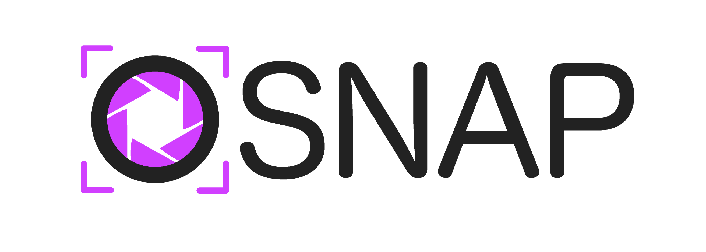

<div align="center">
  
</div>

<h3 align="center"> The speedy and easy to use Snapshot Testing tool for your project! </h3>
<p align="center">
  A Project with around 1200 snapshots will run in under 3 minutes*, <br />
  compared to around 18 minutes it takes other popular snapshot tools to run the same test suite.
</p>
<div align="center">
  <i align="center">* with 20 parallel runners on a 2017 15-inch MacBook Pro.</i>
</div>
<br />
<div align="center">
    
    
</div>

<br />
<br />

# Table of contents

- [How do I install it?](#how-do-i-install-it)
- [How do I use it?](#how-do-i-use-it)
- [Credits](#credits)
- [Contributing](#contributing)

<br />

# How do I install it?

## Docker (recommended)

Use one of the official Docker images at https://hub.docker.com/u/osnap.

<br />

**NOTICE:** <br />
We do recommend using a Docker Container to run the tests, because snapshot tests are by nature pretty susceptible to the smallest changes in rendering. <br />
The biggest problem is, that Browsers render (mainly fonts and images) differently on different devices and operating systems. For the human eye, this is mostly not noticeable, but for an diffing algorithm, these changes are noticeable and will fail the test. <br />
So it is important to always run the tests in the same environment.

<br />
<br />

## npm / yarn

OSnap may be installed with yarn or npm using one of the following commands:

```bash
yarn add @space-labs/osnap --dev
```

or

```bash
npm install @space-labs/osnap --save-dev
```

<br />

# How do I use it?

Before you can run your first test suite, OSnap needs to be configured. To do this, you need at least two files. The global config file and one test file.

After you have created them you have to run `yarn osnap`, `npx osnap` or create a npm script running `osnap` with the optional [cli flags](https://ewert-online.github.io/OSnap/cli) available.

In in-depth documentation with configuration options and examples can be found at:

### **https://ewert-online.github.io/OSnap**

<br />

# Credits

**[ODiff](https://github.com/dmtrKovalenko/odiff):**
ODiff inspired the name of this library and is used as the underlying diffing algorithm.
Thank you for your work [@dmtrKovalenko](https://github.com/dmtrKovalenko)!

<br />

# Contributing

Contributions are always welcome. Here's how to set up the project locally.

**Install opam**

https://opam.ocaml.org/doc/Install.html

**Install dependencies**
```sh
make install
```

**Build the project**
```sh
make
```

# Some things we may want to add:

In decending order of priority (top ones are more important):

- [ ] **A built in static webserver**:
      The speed of the server used to serve the website being tested influences the speed of OSnap a lot. So we want to control that a bit more and provide a built in static web server. <br />
      This also makes it easier to run tests, as you don't have to explicitly wait for the server to be up and running before running osnap.
      <br /><br />
- [ ] **Listen for network requests**:
      Wait for specific network requests to finish, before taking the screenshot. For example: Wait for a failed login attempt to come back, to screenshot the error state
      <br /><br />
- [ ] **Wait for dom events**:
      Maybe we can find a way, to wait for specific events to be triggered on the page. For example: Wait for all animations on the page to complete before taking the screenshot.

<br />

### If you find a bug or think some feature is missing, feel free to submit an issue :)
